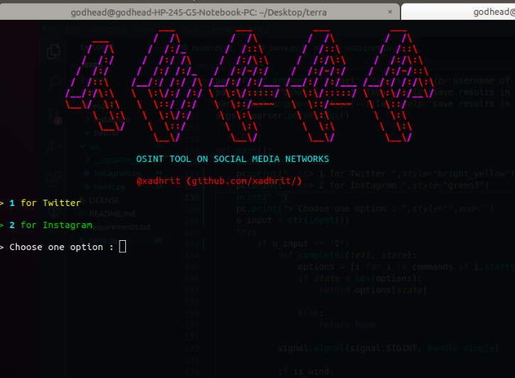

# Terra : 

<p align="center">

</p>

<p align="center">
 Terra : Recon tool on Social Media Networks.
</p>

### Recon Available on :


<p>
Twitter</img>
</p>

<p>
 Instagram </img>
</p>

## Installation

Clone the github repo
```
$ git clone https://github.com/xadhrit/terra.git

```
Change Directory

```
$ cd terra
```


### Requirements :


For requirements run following commands:


```
$ python3 install -r requirements.txt
```


#### Note

For `Twitter` Credentials : 

You need credentials which are listed in twitter.yml file in creds folder for using terra.

You can find more about Twitter Api and Access Tokens on <a href="https://developer.twitter.com/en/docs"> Twitter's Developer Portal
</a>


For `Instagram` Credentails:

Put your Instagram's username and password in `creds/insta.yml` file. And you are good to go.


## Usage :

<p align="center">

</p>

Basic Usage:

```
~/terra$ python3 terra.py <username of target> 

help :  -j for saving results in a JSON file
       -f for text file

```


##  Twitter Recon Commands :

```
ls: Display all Terra Commands

help: For Help 

quit: For quiting the program

clear: For cleaning your terminal screen

exit: For exiting from Terra

reset target : Reset new target in command line

tweets : Get latest tweets tweeted by Target

favtweets : Get latest tweets which favorited by Target

followers : Get target's followers list

following : Get target's following list

info: Get overview and infomation about target

profile pic: Download Target's Profile Picture

banner: Download Target's Profile banner

htags : Get hashtags used by Target

```

### Instgram Recon Commands :

```
ls  : Display Terra Commands,

help : for Help,

clear: for clearning your Screen,

quit: for  quiting,
            
exit:  For Exiting from Terra,
            
locations : For getting Pinned location of target,
            
captions : For gathering target's captions,
          
reset target: For resetting target in Terra,
            
comments : For all comments of target,
            
followers : For getting follower's list of target,
            
followings: For getting following list of target
            
followers emails : For target's followers emails,
            
following emails : For target's  following emails,

followers phone : For target  followers phone numbers,

followings phone : For target  followings phone numbers,

tags  : For getting  hashtags used by target ,

timeline : For overview of target's account ,
            
likes: Get total_likes of target,
            '
mediatype : For information of  photos and video of target,
          
photodes : For gathering  target  photos description,
            '
photos  : For Downloading target's  photos,
            
profile pic : For downloading target's  profile picture,
            
stories : For downloading target's stories ,
          
tagged': For listing user who tagged by target,

commenter': For getting all user who commented on target's posts
            
ttag : For listing user tagged target in their posts

```

## Future Plans :

Will be support other social media networks soon.

## Contribution :

Every pull request with good and understandable code :) is welcomed. 

## TourbleShooting

Open an issue on Github.

## External Libraries :

Python-twitter : https://github.com/bear/python-twitter

Instagram Private API :  https://github.com/ping/instagram_private_api


